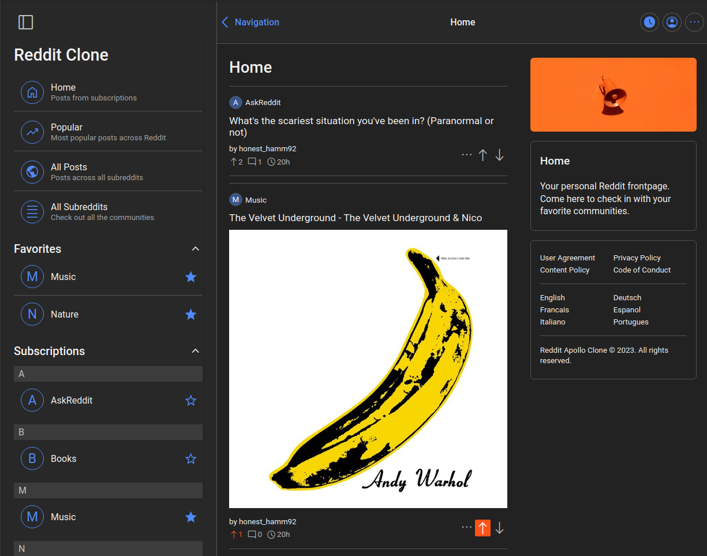
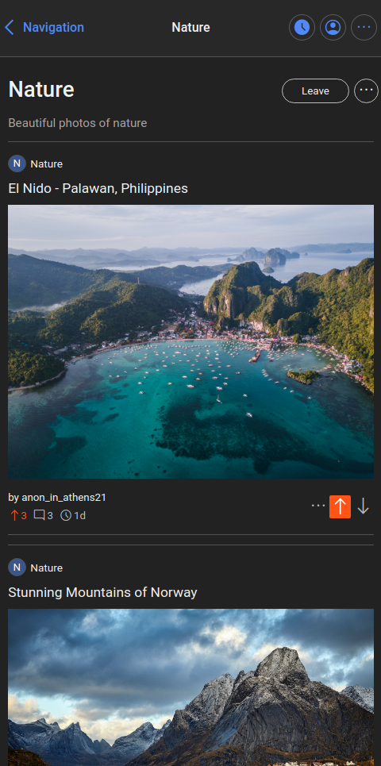

# Project: Reddit Apollo Clone

[**Live version** of the app can be found here](https://reddit-apollo-clone.vercel.app/)

This is a full-stack clone of Reddit, styled in the manner of the iOS Apollo App--replicating the popular social media platform's core functionalities. With its feature set, the clone encompasses both the front-end and back-end components, providing a seamless user experience akin to that of the Apollo App on iOS devices.

### Features

1. **Reddit Features**: The app incorporates the basic features of Reddit such as creating subreddits, text posts, image posts, and comments; upvoting/downvoting posts and comments; subscribing to subreddits; and bookmarking posts.

2. **Back-end Integration**: The app uses Firebase Firestore to store app data such as user, post, and subreddit details. Images are stored in Firebase Storage.

3. **Authentication**: Users are authenticated through Firebase Authentication. An option to sign up using either Email or Google is provided.

4. **Dark Mode**: Dark mode is integral to the Reddit experience and is also implemented site-wide in this clone through Sass mixins.

### Technologies Used

- Typescript
- React + NextJS
- Firebase (Firestore, Authentication, & Storage)
- Sass

### Credits/Acknowledgments

This project is for personal use only. I do not own any of the rights for the assets used in this project. The design of this clone is based on the [Apollo App](https://apolloapp.io/) on iOS.

### Display

_Home Page_

_Mobile View_

### To-do

1. Add a search feature for posts.

2. Add a feature to sort comments by new or popular.

---

Developed by **Renchester Ramos**
